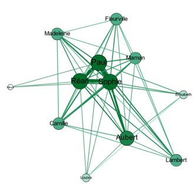
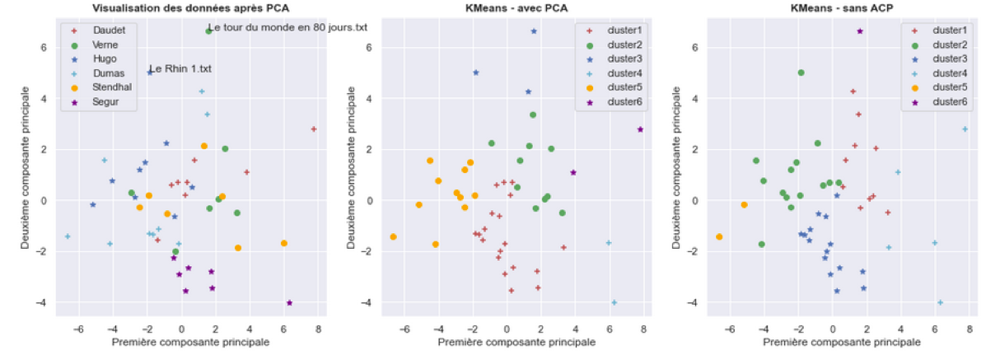
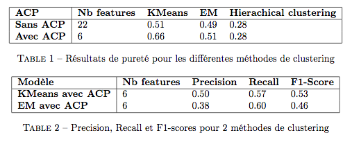

# Graph based Novel clustering

_Détails de la méthode : [Graph_clustering.pdf](https://github.com/simondelarue/Graph-based_Novel_Clustering/blob/main/Graph_Clustering.pdf)_

**Objectif**
> Détecter les auteurs d'oeuvres littéraires, sur la base du **graphe d'interactions** de leurs personnages

## Approche générale

Les techniques classiques de stylométrie se basent sur une approche majoritairement statistique de l'analyse de texte. Ici, on cherche à étudier si - au delà de son style d'écriture - un auteur ne possède pas des caractéristiques qui lui sont propres dans la création d'une **intrigue romanesque**.

L'hypothèse générale est qu'un auteur aura tendance à créer des intrigues semblables, qu'on pourra représenter par les **interactions entre personnages**.   
Ainsi, pour chaque roman, on construit la **matrice de co-occurrences** des interractions entre personnages. Sur cette base, on modélise les interractions sous forme d'un **graphe non orienté, pondéré**, pour lequel on calcule un ensemble de métriques, représentées sous forme d'un unique vecteur de features. 
Enfin, nous appliquons des méthodes de **clustering** sur la matrice des données construire, afin de détecter automatique les auteurs des oeuvres considérées.

## Données

Les données sont des oeuvres littéraires françaises issues du [Projet Gutenberg](http://www.gutenberg.org/). On récupère 47 textes, produits par 6 auteurs différents.

Les données sont stockées dans le répertoire `input`.

## Graphe d'interactions des personnages

### Construction de la matrice de co-occurences

Cette matrice permet de retenir le nombre d'interactions des personnages dans une fenêtre de temps du récit. Le contenu de cette matrice permettra de **pondérer** le graphe construit dans les étapes suivantes, et donc de dégager l'intensité des échanges entre personnages du roman à instant $t$.

```python
def count_occurences(text_window):
    
    occurences_tot = {}
    text_window_tmp = text_window

    # Parcours de tous les personnages de la text window
    for character in text_window_tmp:
        remaining_chars = text_window_tmp

        remaining_chars.remove(character)

        occurences_perso = {}
        for remaining_char in remaining_chars:
            if remaining_char != character:
                occurences_perso[remaining_char] = occurences_perso.get(remaining_char, 0) + 1

        # On affecte toutes ses interractions au personnage
        occurences_tot[character] = occurences_perso 
        
    return occurences_tot
```

### Graphes d'interactions

La matrice de co-occurences permet de construire les graphes d'interactions des personnages (non orientés, pondérés).   

Ci-dessous, les graphes d'interactions pour deux romans (_à gauche, le "Comte de Monte Cristo" d'Alexandre Dumas, à droite, "Les malheurs de Sophie" par la comtesse de Segur_)

<table><tr>
<td>  </td>
<td>  </td>
</tr></table>


## Clustering de graphes

Chaque roman est représenté sous la forme d'un vecteur contenant plusieurs métriques (22 au total) spécifiques aux objets _graphes_.  
Une méthode de **clustering** (apprentissage non supervisé) est appliquée à l'ensemble de données, afin d'en détecter les auteurs.

**Résultats**

Deux métriques distinctes sont uilisées pour comparer les résultats obtenus, la **pureté** :
```math
purity = \dfrac{1}{N}\sum_k{max_j(W_k \cap C_j)}
```

et le **F1-score** :
```math
F1-score = 2 * \dfrac{precision*recall}{precision+recall}
```

  

 L'utilisation d'un algorithme de KMeans (avec Analyse en composante principale appliquée au préalable) permet d'obtenir un score de _pureté_ de 66%.
 
  


